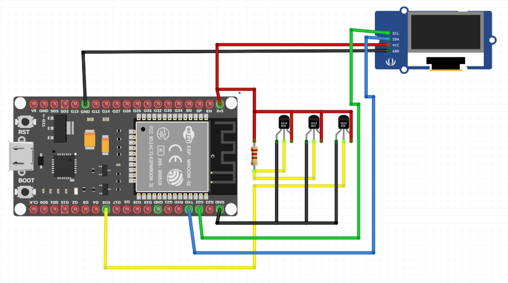
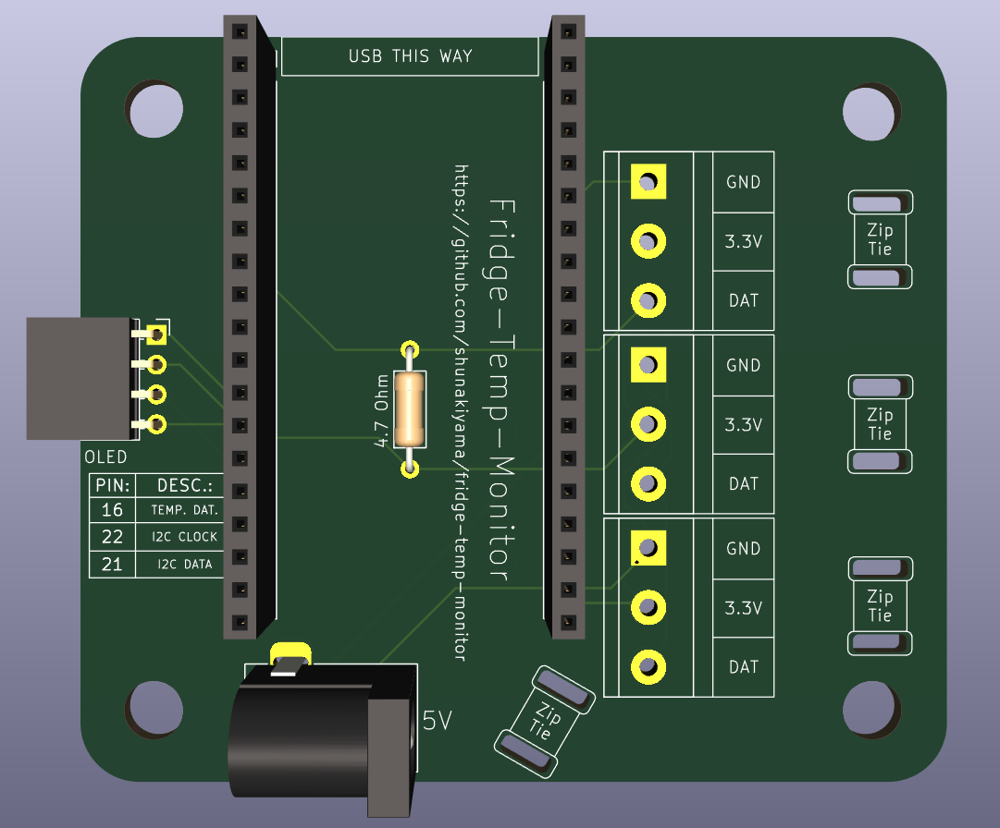

# 🇵🇱 Urządzenie monitorujące temperaturę w lodówce
To oparte na ESP32 urządzenie oferuje monitorowanie wielu stref w twojej lodówce. Temperaturę możesz odczytać lokalnie z wyświetlacza oraz
przez portal webowy lub aplikację HomeAssistent.

## Dlaczego?
Nie każda lodówka jest zbyt dobra albo nie każda jest na tyle nowa aby posiadać termostat. Dzięki temu urządzeniu możesz monitorować i zapisywać 
temperaturę w swojej lodówce aby mieć pewność że utrzymuje temperaturę w bezpiecznych limitach oraz poprawić poziom chłodzenia gdy widzisz że jest 
nie odpowiedni.

Posiadacze dobrych lodówek też mogą skorzystać z tego urządzenia gdyż pozwala na monitorowanie kilku stref naraz, coś co dopiero drogie, high-end, lodówki 
posiadają.

## Pliki
```
|--code
    |--esphome
    |--v3_multiple_sensors
|--models
    |--solidworks
    |--3d_printing
|--pcb
    |--fridge_temp_design
        |--[WSZYSTKIE PLIKI]
    |--gerber

```
Folder ```code``` posiada wszystkie pliki związane z oprogramowaniem. Aktualna wersja, używająca ESPHome, jest w folderze ```esphome```. Wersja C++ (.ino) jest w
```v3_multiple_sensors```.

Folder ```models``` posiada wszystkie pliki związane z obudową. Folder ```solidworks``` posiada wszytskie pliki z programu SolidWorks, otwórz te pliki 
w Soliwroks aby edytować ten design. Folder ```3d_printing``` posiada modele wyeksportowane do ```.stl```, gotowe do druku 3d.

Folder ```pcb/fridge_temp_design``` posiada wszystkie pliki dotyczące PCB.

Folder `pcb/gerber` zawiera wszystkie pliki gerber.

## Plany



Te plany zostały stworzone w oprogramowaniu Fritzing. Ta wersja skupia się wyłącznie na działających częściach komponentu, pomijając szczegóły takie jak zasilanie czy rozwiązania montażowe.

## Wersja 2

Oto jak powinna wyglądać płytka PCB po wlutowaniu większości komponentów (nie ma tu złącz ARK/śrubowych, ponieważ nie udało mi się znaleźć ich modelu). Proszę zwrócić uwagę na specjalne otwory przeznaczone na opaski zaciskowe – przymocują one kable termometrów, zmniejszając naprężenie na złączach.




# 🇬🇧 Fridge temperature monitoring device
This ESP32 based device allows for temperature monitoring in many zones at once in your fridge. You can read the temperature locally or on a HomeAssistant's
webportal or app.

## Why?
Not every fridge is good or new enough to have a thermostat. Thanks to this device you can monitor and record your fridge's temperature and be sure it
keeps itself in the safe limits, adjust it based on the readings.

The owners of good fridges also can use this device as it allows the monitoring of many zones at once which only the expensive, high-end, ones can do.

## Files
```
|--code
    |--esphome
    |--v3_multiple_sensors
|--models
    |--solidworks
    |--3d_printing
|--pcb
    |--fridge_temp_design
        |--[ALL FILES]
    |--gerber
```

Folder ```code``` has all files related to software. Current version, using ESPHome, is in ```esphome```. C++ version (.ino) is in ```v3_multiple_sensors```.

Folder ```models``` has all the files related to the case. Folder ```solidworks``` has all the SolidWorks files, use these files to edit the design.
Folder ```3d_printing``` has all the models exported to ```.stl```, ready to be 3d printed.

Folder ```pcb/fridge_temp_design``` has all files related to the PCB design. 

Folder `pcb/gerber` has all gerber files. 

## Plans


These plans were created in Fritzing software. This version focuses solely on the working parts of the component, omitting details like power delivery or mounting solutions.

## Version 2

This shows how the PCB should look when most of the components are soldered (there are no ARK/screw terminals, as I could not find a model for them). Please notice the special holes designed for zip ties; they will tie down the thermometer cables, reducing the strain on the connectors.

